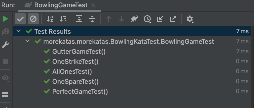
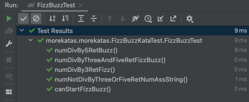

# Some katas java 🥋
This repository gathers several Katas as a training for:
- Test Driven Development (TDD)
- SOLID principles for Clean Code
- Object Oriented Programming (OPP) principles: Data Abstraction, Encapsulation, Inheritance and Polymorphism

🚥 Test → Red → Green → Refactor 🔁

## Develop 📌

```
Start a project at Spring Initializr
Or clone/fork this repo
Run the tests to see them pass!
```

## Tech Stack & Tools 🛠

- [Spring Boot](https://spring.io/projects/spring-boot)
- [IntelliJ Idea](https://www.jetbrains.com/idea/) or any other IDE you like
- JAVA

## 1 - Bowling Kata 🎳

* The game consists of 10 turns. On each turn, the player has 2 chances to throw the ball to knock down all 10 pins 
* The score for each turn is the total number of pins knocked down, plus extra points for strikes 
* If the player knocks down all 10 pins on the first throwing of the turn, he makes a strike and does not need to make the second roll of the turn. The score for this turn is 10 plus the number of pins knocked down in the next two throws
* If the player knocks down all 10 pins in both throwing of the turn, they make a spare. The score for this turn is 10 plus the number of pins knocked down in the next throw
* If in the last turn a player makes a strike, he is allowed to throw the extra balls to complete the turn. However, it is not allowed to throw more than 3 balls in this turn

<p align="center">

</p>

## 2 - FizzBuzz Kata 🔠

Write a program/function that, as a parameter, receives a number from 1 to 100 and returns:
* For multiples of three, return a string: "Fizz" instead of the number
* For multiples of five, return a string: "Buzz" instead of the number
* For numbers that are multiples of three and five, return a string: "FizzBuzz" instead of the number
* Of course... for numbers that are not multiples of three and five, it must return the same number

<p align="center">

</p>

## 3 - Leap Years Kata 📅

## 4 - Shopping Kata 🛒