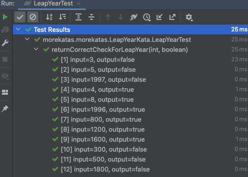
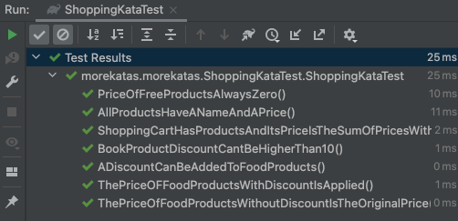

# Some katas java 🥋
This repository gathers several Katas as a training for:
- Test Driven Development (TDD)
- SOLID principles for Clean Code
- Object Oriented Programming (OPP) principles: Data Abstraction, Encapsulation, Inheritance and Polymorphism

🚥 Test → Red → Green → Refactor 🔁

## Develop 📌

```
Start a project at Spring Initializr
Or clone/fork this repo
Run the tests to see them pass!
```

## Tech Stack & Tools 🛠

- [Spring Boot](https://spring.io/projects/spring-boot)
- [IntelliJ Idea](https://www.jetbrains.com/idea/) or any other IDE you like
- JAVA

## 1 - Bowling Kata 🎳

* The game consists of 10 turns. On each turn, the player has 2 chances to throw the ball to knock down all 10 pins 
* The score for each turn is the total number of pins knocked down, plus extra points for strikes 
* If the player knocks down all 10 pins on the first throwing of the turn, he makes a strike and does not need to make the second roll of the turn. The score for this turn is 10 plus the number of pins knocked down in the next two throws
* If the player knocks down all 10 pins in both throwing of the turn, they make a spare. The score for this turn is 10 plus the number of pins knocked down in the next throw
* If in the last turn a player makes a strike, he is allowed to throw the extra balls to complete the turn. However, it is not allowed to throw more than 3 balls in this turn

<p align="center">

</p>

## 2 - FizzBuzz Kata 🔠

Write a program/function that, as a parameter, receives a number from 1 to 100 and returns:
* For multiples of three, return a string: "Fizz" instead of the number
* For multiples of five, return a string: "Buzz" instead of the number
* For numbers that are multiples of three and five, return a string: "FizzBuzz" instead of the number
* Of course... for numbers that are not multiples of three and five, it must return the same number

<p align="center">

</p>

## 3 - Happy Birthday Exercise 🎂

* It's your best friend's birthday! You already bought a box for the present. Now you want to pack the present in the box. You want to decorate the box with a ribbon and a bow. But how much cm of ribbon do you need?
* Write the method wrap that calculates that!
* A box has a height, a width and a length (in cm). The ribbon is crossed on the side with the largest area. Opposite this side (also the side with the largest area) the loop is bound, calculate with 20 cm more tape.

## 3 - Leap Years Kata 📅

* All years divisible by 400 ARE leap years (so, for example, 2000 was indeed a leap year)
* All years divisible by 100 but not by 400 are NOT leap years (so, for example, 1700, 1800, and 1900 were NOT leap years, NOR will 2100 be a leap year)
* All years divisible by 4 but not by 100 ARE leap years (e.g., 2008, 2012, 2016)
* All years not divisible by 4 are NOT leap years (e.g. 2017, 2018, 2019)

<p align="center">

</p>

## 4 - Shopping Kata 🛒

* All products must have a name and price
* The price of a free product is always 0
* A discount can be applied to food products
* The price of a product without discount is the product' original price
* The price of a product with a discount is the price with the applied discount
* The shopping kart contains a certain number of products, which can be zero
* The total cost of the kart is the sum of the products prices with discounts applied
* Book products also have authorship and description, and a maximum of a 10% discount can be applied

<p align="center">

</p>